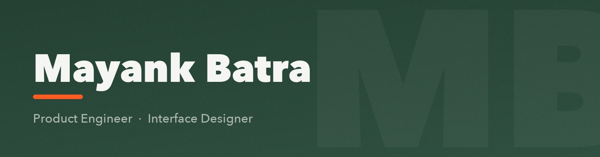

<picture>
  <source media="(prefers-color-scheme: dark)" srcset=".github/assets/hero-dark.jpg">
  
</picture>

<h3 align="center">I build gesture-driven mobile interfaces, design systems, and offline-first web architecture.</h3>

<p align="center">
  <a href="#featured-work">Featured work</a> &nbsp;&nbsp;•&nbsp;&nbsp;
  <a href="#craft">Craft</a> &nbsp;&nbsp;•&nbsp;&nbsp;
  <a href="https://github.com/Ghost-9?tab=repositories">All repositories</a> &nbsp;&nbsp;•&nbsp;&nbsp;
  <a href="https://github.com/Avartana-Labs">Avartana Labs</a>
</p>

---

### Craft

I work where interaction design and engineering rigor meet: 60fps gestural fluency, deliberate micro-interactions, and architecture that survives a bad network.

* **Mobile** — declarative UI in Flutter & SwiftUI, with custom physics, haptic pacing, and gesture-driven navigation.
* **Web** — Next.js, React and TypeScript, with component-driven design systems and responsive layouts across viewports.
* **Systems** — offline-first caching, embedded stores such as Sembast, and packaging that ships as PWA, APK, or native.

---

### Featured work

<table>
  <tr>
    <td width="50%" valign="top">
      <h4>🪑 <a href="https://github.com/Ghost-9/Furniture-App-UI">Furniture App UI</a></h4>
      <p>Gesture-driven interior catalog. Collection carousels, responsive multi-device viewports, and story-style swipe transitions.</p>
      <p><code>Flutter</code> <code>Dart</code> <code>Adaptive Layouts</code> <code>UI/UX</code></p>
    </td>
    <td width="50%" valign="top">
      <h4>💼 <a href="https://github.com/Ghost-9/employee-ledger">Employee Ledger PWA</a></h4>
      <p>Executive team directory with real-time KPI headcount metrics, instant substring search, tenure computation, and offline-first Sembast persistence.</p>
      <p><a href="https://ghost-9.github.io/employee-ledger/"><strong>🚀 Launch Live PWA</strong></a> &bull; <code>Flutter Web</code> <code>BLoC 9.x</code> <code>Sembast</code></p>
    </td>
  </tr>
  <tr>
    <td width="50%" valign="top">
      <h4>🏥 <a href="https://github.com/Ghost-9/caretaker">CareTaker Concierge</a></h4>
      <p>Healthcare web application built with Next.js 15 and Tailwind CSS. Features an editorial bento layout, care protocol tiers, and online patient intake.</p>
      <p><a href="https://ghost-9.github.io/caretaker/"><strong>🌐 Launch Live Site</strong></a> &bull; <a href="https://caretaker-nine.vercel.app"><strong>⚡ Vercel Mirror</strong></a> &bull; <code>Next.js 15</code> <code>Tailwind CSS</code></p>
    </td>
    <td width="50%" valign="top">
      <h4>☕ <a href="https://github.com/Ghost-9/Coffee-App">Artisan Coffee</a></h4>
      <p>OLED-tuned ordering experience: interactive roast search, fluid category switching, and a cart with tactile physics.</p>
      <p><code>Flutter</code> <code>Dart</code> <code>Material 3</code> <code>OLED Dark</code></p>
    </td>
  </tr>
  <tr>
    <td width="50%" valign="top">
      <h4>🌤️ <a href="https://github.com/Ghost-9/Weather-App">Cupertino Weather</a></h4>
      <p>Native iOS &amp; macOS app in SwiftUI. Dynamic diurnal cycles, thin frosted-glass telemetry, and SF Symbols throughout.</p>
      <p><code>Swift</code> <code>SwiftUI</code> <code>macOS</code> <code>HIG</code></p>
    </td>
    <td width="50%" valign="top">
      <h4>🧰 <a href="https://github.com/Ghost-9?tab=repositories">The full archive</a></h4>
      <p>macOS utilities, prototypes, and design experiments — including an offline dictation tool and a usage-limit pinner for coding agents.</p>
      <p><code>Swift</code> <code>Tauri</code> <code>TypeScript</code></p>
    </td>
  </tr>
</table>

---

<!-- ROADMAP:START -->

## What we are building

### Notes

- Notes download as a single JSON file
- The page follows your system light or dark setting
- Results narrow as you type, and an empty query keeps what was there
- Notes keep the order you left them in, newest first
- A note saves without a title, and gets one the moment it opens

### Client operations platform

- extend offline-awareness to devices, milestones and summaries
- clear offline cache on sign-out, show pending-changes badge
- route tasks/goals/projects/devices mutations through MutationQueue
- dashboard screen for Mission Control engine (Supabase mirror)
- add Supabase sync queue for offline writes
- offline cached rendering with invalidation
- _…and 4 more in the history_

## What has shipped

### v0.1.0

**Notes**

- A note can be pinned to the top, above the rest
- Export writes Markdown beside the JSON
- Search reads tag names as well as the note text
- A note carries more than one tag, and no tag is required


<!-- ROADMAP:END -->

---

### Stack

```
Mobile      Flutter · Dart · Swift · SwiftUI
Web         TypeScript · React · Next.js · Tailwind CSS
State       BLoC / Provider · Sembast · Offline-First · REST
Tooling     Xcode · Android Studio · Git · GitHub Actions · Vercel
```

---

<p align="center">
  <sub>Built at <a href="https://github.com/Avartana-Labs">Avartana Labs</a> · <a href="https://github.com/Ghost-9">github.com/Ghost-9</a></sub>
</p>
